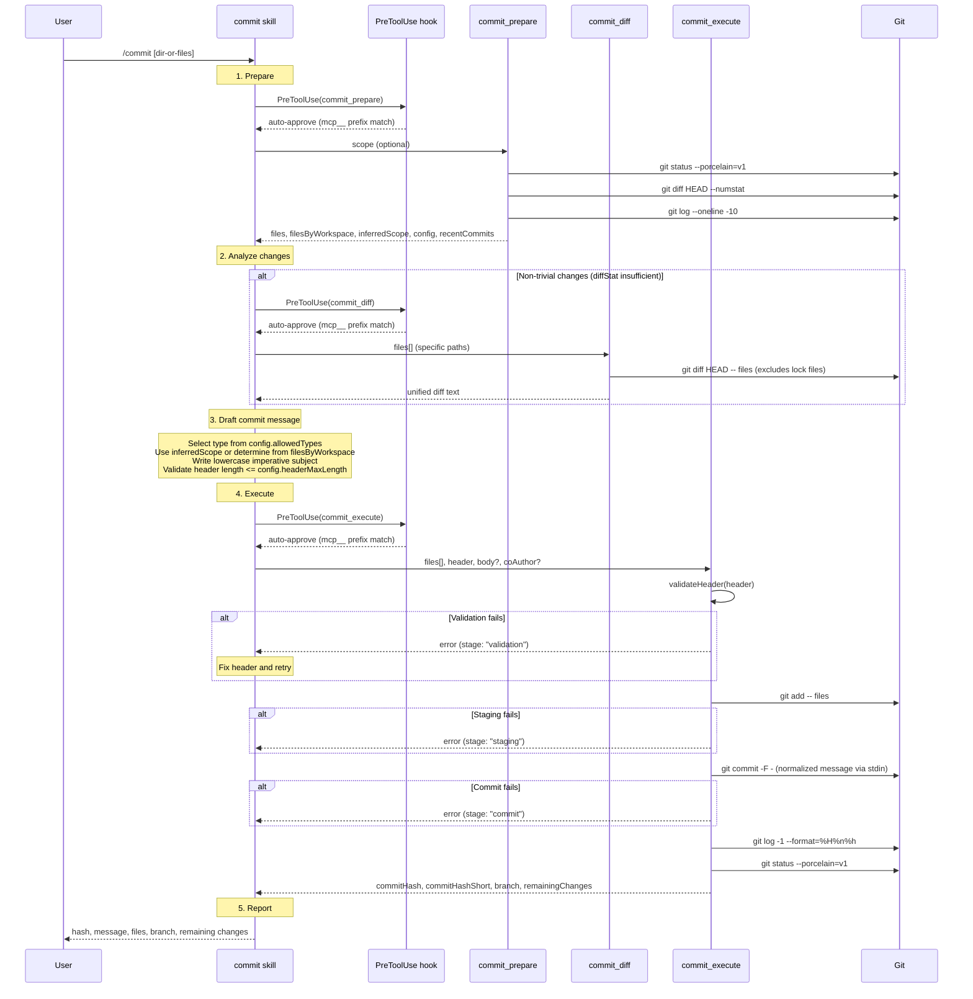

# Commit Skill

## Overview

The `commit` skill stages and commits changes using conventional commits format. It uses three MCP tools — `commit_prepare`, `commit_diff`, and `commit_execute` — in a prepare-analyze-execute workflow, with a skill-scoped `PreToolUse` hook that auto-approves the plugin's MCP tools so the workflow runs without user prompts.

## Workflow



## Tool Interface Reference

### `commit_prepare`

Gathers repository state so the LLM can draft a conventional commit message.

**Input parameters:**

| Field | Type | Required | Description |
|-------|------|----------|-------------|
| `scope` | `string` | No | A directory path, comma-separated file paths, or omit for all changes |

**Success response** (JSON in `content[0].text`):

| Field | Type | Description |
|-------|------|-------------|
| `repoRoot` | `string` | Absolute path to the git repository root |
| `branch` | `string` | Current git branch name |
| `files` | `FileStatus[]` | Flat array of changed files with per-file metadata |
| `filesByWorkspace` | `Record<string, FileStatus[]>` | Files grouped by workspace directory; root-level files under `"(root)"` |
| `inferredScope` | `string \| null` | Deterministic scope suggestion, or null when ambiguous |
| `recentCommits` | `string[]` | Last 10 commit messages (oneline format) |
| `config` | `object` | `{ allowedTypes: string[], headerMaxLength: number, workspaceDirs: string[] }` |
| `warnings` | `string[]` | Warnings (e.g., scoped files not found) |

**`FileStatus` shape:**

| Field | Type | Description |
|-------|------|-------------|
| `path` | `string` | File path relative to repo root |
| `status` | `string` | Human-readable status, e.g. `"staged:modified"`, `"untracked"` |
| `staged` | `boolean` | Whether the file is already staged |
| `diffStat` | `string \| null` | Lines added/removed summary, e.g. `"+12 -3"`. Null for untracked files |
| `workspaceDir` | `string \| null` | Monorepo workspace directory, e.g. `"packages/core"`. Null for root-level files |

**Error response:** MCP error with text message.

---

### `commit_diff`

Returns the unified diff for specific files or all changed files. Lock files are always excluded.

**Input parameters:**

| Field | Type | Required | Description |
|-------|------|----------|-------------|
| `files` | `string[]` | No | File paths (relative to repo root) to diff. Omit for all changed files |

**Success response:** Raw unified diff text in `content[0].text`. Returns `"(no changes)"` when there is no diff.

**Excluded files:** `pnpm-lock.yaml`, `package-lock.json`, `yarn.lock`, `bun.lock`

**Error response:** MCP error with text message.

---

### `commit_execute`

Stages files, validates the commit header, executes the commit, and verifies the result in a single call.

**Input parameters:**

| Field | Type | Required | Description |
|-------|------|----------|-------------|
| `files` | `string[]` | Yes | Absolute paths to files to stage and commit |
| `header` | `string` | Yes | Conventional commit header: `type(scope): subject` |
| `body` | `string` | No | Commit body explaining motivation and context |
| `coAuthor` | `string` | No | Co-author name, e.g. `"Claude Sonnet 4.6"` |

**Success response** (JSON in `content[0].text`):

| Field | Type | Description |
|-------|------|-------------|
| `success` | `true` | |
| `commitHash` | `string` | Full SHA |
| `commitHashShort` | `string` | Abbreviated SHA |
| `commitMessage` | `string` | Normalized commit message (header lowercased) |
| `branch` | `string` | Current branch name |
| `remainingChanges` | `number` | Count of remaining uncommitted files |

**Error response** (JSON in `content[0].text`):

| Field | Type | Description |
|-------|------|-------------|
| `success` | `false` | |
| `isError` | `true` | |
| `stage` | `"validation" \| "staging" \| "commit"` | Pipeline stage where the failure occurred |
| `errors` | `string[]` | Error messages |

## Behavioral Rules

### Header validation

The `commit_execute` tool validates the header before staging. All checks must pass or the tool returns a `stage: "validation"` error.

| Rule | Check | Example violation |
|------|-------|-------------------|
| Format | Must match `type(scope): subject` (scope optional) | `"fixed the bug"` |
| Max length | Header must not exceed 100 characters | 101+ character header |
| Allowed types | Type must be one of: `ai`, `build`, `chore`, `ci`, `docs`, `feat`, `fix`, `perf`, `refactor`, `revert`, `style`, `test` | `type: "feature"` |
| Lowercase subject | Subject must be fully lowercase | `"Add user endpoint"` |
| No trailing period | Subject must not end with `.` | `"add user endpoint."` |

### Path validation

All file paths passed to `commit_execute` must resolve to within the git repository root. Paths outside the repo are rejected at the `stage: "validation"` level.

### Scope inference

`commit_prepare` deterministically suggests a scope from the changed file set:

| Condition | Inferred scope |
|-----------|---------------|
| All files in a single workspace (e.g. `packages/core`) | That workspace directory |
| Files span multiple workspaces under different top-level dirs | `"monorepo"` |
| Files span multiple workspaces under the same top-level dir | `null` (LLM decides — can't determine primary vs. ripple) |
| Root-level files only | `null` (omit scope) |
| Mix of root files and workspace files | `null` (LLM decides) |

Workspace detection uses the prefixes: `apps`, `marketplaces`, `packages`, `toolchain`. A file at `packages/core/src/index.ts` maps to workspace `packages/core`.

### File exclusions

- `.env` files are never staged or committed, even if explicitly requested (enforced by SKILL.md instructions)
- Lock files (`pnpm-lock.yaml`, `package-lock.json`, `yarn.lock`, `bun.lock`) are excluded from `commit_diff` output but their `diffStat` is still returned by `commit_prepare`

### Header normalization

Before committing, the full message header is lowercased (the body and footer are preserved as-is). This is enforced by `normalizeHeader()` which lowercases everything before the first newline.

### PreToolUse hook (skill-scoped)

A skill-scoped `PreToolUse` hook auto-approves any tool whose name starts with `mcp__plugin_plugins-dev-tools_dev-tools__`. This covers all three commit MCP tools, allowing the prepare-diff-execute workflow to run without user prompts. Non-matching tools pass through to normal permission handling.

## Output Format

### Commit message format

```
type(scope): subject

optional body

Co-Authored-By: Claude Sonnet 4.6 <noreply@anthropic.com>
```

- Header: `type(scope): subject` — scope is optional
- Body: separated from header by a blank line; imperative mood
- Co-author trailer: appended when `coAuthor` is provided, separated by a blank line

### Success report

After a successful commit, the skill displays:
- Short commit hash and full commit message
- List of committed files
- Current branch name
- Count of remaining uncommitted changes

## Reference

| File | Description |
|------|-------------|
| [`skills/commit/SKILL.md`](../skills/commit/SKILL.md) | Skill instructions |
| [`skills/commit/conventional-commits.md`](../skills/commit/conventional-commits.md) | Conventional commits reference |
| [`src/mcp/tools/commit.ts`](../src/mcp/tools/commit.ts) | MCP tool implementations (prepare, diff, execute) |
| [`src/skills/commit/commit.ts`](../src/skills/commit/commit.ts) | Shared commit utilities (normalizeHeader, assembleMessage, commit) |
| [`src/skills/commit/hooks/pre-tool-use/index.ts`](../src/skills/commit/hooks/pre-tool-use/index.ts) | Skill-scoped PreToolUse hook (auto-approve MCP tools) |
| [`src/mcp/server.ts`](../src/mcp/server.ts) | MCP server entry point |
